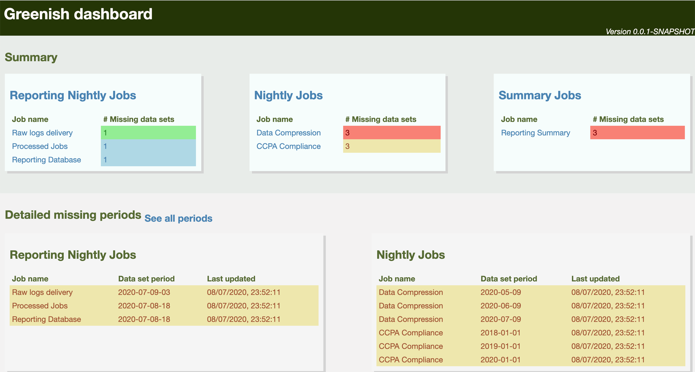

[](https://travis-ci.org/amanjpro/greenish)
[](https://codecov.io/gh/amanjpro/greenish) [](https://gitter.im/greenish-monitoring/greenish?utm_source=badge&utm_medium=badge&utm_campaign=pr-badge&utm_content=badge)

Greenish is a monitoring tool, that can be used to monitor the presense of
data-sets. Greenish understands periods, for example for an hourly job,
Greenish can check for data for all the past _N_ hour data-sets.

Greenish jobs are configured in a
[YAML-like](https://github.com/lightbend/config) configuration file, [here is
an annotated example](src/test/resources/application.conf). Greenish provides
default values for most of the settings, the defaults can be found
[here](src/main/resources/reference.conf).

Greenish does not have a standard monitoring scripting language/plugin.
Monitoring tasks can be in any executable form, details are in [Monitoring
Jobs](#monitoring-jobs).

## Greenish dashboard

Greenish provides a basic HTML dashboard to visualise the state of the
monitored jobs. The dashboard can be accessed at: `/dashboard` endpoint.
Here is a screenshot:



## The API

Greenish API is documented [here](doc/api.md)

## Who uses Greenish?

Greenish is still new. As of now, [Samsung
Ads](https://www.samsung.com/us/business/samsungads/) uses Greenish to monitor
a _very sensitive and business critical set of datasets_.

## Greenish vs. Others

**Nagios** is a monitoring tool for systems, network and infra. It is very good to
keep track of the current state of the system. But it does not know about data
sets that follow a periodic pattern (daily jobs, hourly jobs and etc.). Making
Nagios aware of periods is entirely on the shoulder of the check writers, which
can be very tricky to do (or even impossible?).

**Prometheus** is another great tool for monitoring metrics, and the health of
other systems, but again it doesn't know about datasets that follow periodic
patterns. It is worth mentioning that Greenish provides an endpoint to export metrics to _Prometheus_.

**Airflow** knows about periods, but it is not a monitoring tool. Airflow can
alert when a run fails, but if a computed data was mistakenly deleted Airflow
stays unaware.

What set's Greenish apart is that, it knows about periods, and keeps checking
the existence of the datasets.

## Monitoring Jobs

As mentioned earlier, monitoring jobs can be any executable program, as long as:

- They are executable
- They accept a variable number of `period` arguments, as their last argument
  sets: `$ monitor_my_job.sh staging 2020-20-06-10 2020-20-06-11 ...`
  The above is an example of a monitoring script that is written in a
  `shell-like` scripting language. In the example, the script takes a
  parameter for the environment (in this case, `staging` is applied), and takes
  a set of `period` parameters, in the example: `2020-02-06-10` and
  `2020-02-06-11` are passed.

  The `check-command` entry for the above example will be:
  ```
    check-command: "monitor_my_job staging"
    period-pattern: "yyyy-MM-dd-HH"
  ```

- They print the health for every provided periods, exactly once, in the
  following format: `greenish-period\t$PERIOD\t1` when the period's health is
  OK, or `greenish-period\t$PERIOD\t0` otherwise. It is important that:
    - `$PERIOD` is in the list of the provided periods.
    - The text above is in a separate line, namely the line should match:
      `^greenish-period\t.*\t(0|1)$`.
    - The three parts of the line are tab separated.
- The scripts can have any number of debugging/application output lines.
- The script should exit with 0, under normal circumstances even if the entire
  set of periods are not in a good health.

An example monitoring script can be like this:

```
#!/usr/bin/env bash

farm=$1

shift

echo "LETS PRINT THINGS"

for period in "$@"; do
  echo "DEBUG HERE TOO"
  if ls "$farm/$period"; then
    echo -e "greenish-period\t$period\t1"
  else
    echo -e "greenish-period\t$period\t0"
  fi
done
```

## Performance Tweaking

The monitoring jobs are usually blocking IO jobs. Do that network call, wait
for this API, connect to a DB, HDFS etc. That is why they are running under
their very own execution context (thread pool). So that they do not block the
rest of the service (namely the endpoints). The execution context config for
the monitoring jobs are controlled by a dispatcher named `refresh-dispatcher`.
Greenish comes with a default config that is suitable for IO-bound processes,
you can find it in the default settings mentioned earlier.

It is best to use `thread-pool-executor` dispatcher for blocking jobs, as they
are tailored for IO jobs. More information can be found:

- [ThreadPoolExecutor Javadoc](https://docs.oracle.com/javase/8/docs/api/java/util/concurrent/ThreadPoolExecutor.html)
- [Akka documentaiton](https://doc.akka.io/docs/akka-http/current/handling-blocking-operations-in-akka-http-routes.html#solution-dedicated-dispatcher-for-blocking-operations)

## Logging

Greenish uses Akka's simple logging mechanism. In the spirit of [12 factor
App](https://12factor.net/logs) all logs are written to STDOUT, and the
configuration can be done via the `application.conf` file. The following
is a summary of some of the most useful options for customizing logging:

```
akka {
  # Log the complete configuration at INFO level when Greenish is started.
  # This is useful when you are uncertain of what configuration is used.
  log-config-on-start = on
  # Options are: OFF, DEBUG, INFO, ERROR, WARN
  loglevel = "DEBUG"
  # To turn off logging completely
  stdout-loglevel = "OFF"

  # Not necessarily useful in prod, but can be useful during development
  # You probably want to skip the following in produciton
  log-dead-letters = 10
  log-dead-letters-during-shutdown = on
  actor {
    debug {
      # enable function of LoggingReceive, which is to log any received message at
      # DEBUG level
      receive = on
      # enable DEBUG logging of all AutoReceiveMessages (Kill, PoisonPill etc.)
      autoreceive = on
      # enable DEBUG logging of actor lifecycle changes
      lifecycle = on
      # enable DEBUG logging of unhandled messages
      unhandled = on
      # enable DEBUG logging of all LoggingFSMs for events, transitions and timers
      fsm = on
    }
  }
}
```

## Pre-built package

You can download pre-built packages (both fat (i.e. assembly) jar and docker)
from the [releases page](https://github.com/amanjpro/greenish/releases). The
latest docker image can be found at the [packages
page](https://github.com/amanjpro/greenish/packages).

## Development

### Requirements

- Java 8
- SBT 1.3.x
- Bash
- NodeJS 14+

### Building from the source

First install `npm` dependencies:

`$ npm install`

SBT takes care of building/testing both the Scala and JavaScript/JSX:

`$ sbt clean test package`

To run the service from the source:
`$ sbt -Dconfig.file=PATH_TO_CONFIG_FILE run`

**Note** Unfortunately, the JavaScript code has no tests yet, this is an issue
that needs to be resolved.

#### Packaging

Greenish supports both "fat jar" and docker. Fat jar is a single and
self-contained jar that can be distributed on any *nix environment (as long as
Java and Bash are installed):

```
$ sbt assembly
$ java -Dconfig.file=PATH_TO_CONFIG_FILE -jar target/scala-2.13/greenish-assembly-*.jar
```

You can also build docker images:

```
$ sbt docker:publishLocal
# The docker image expects config to be mounted at: /app/config.yml
$ docker run --volume PATH_TO_CONFIG_FILE:/app/config.yml --rm -p 8080:8080 greenish:LATEST_VERSION
```

## Contributing

Contributions are most welcome. Please, fork it, use it, open issues and submit PRs!

## Acknowledgment

- Thanks to [Nasrin Zaza](https://www.linkedin.com/in/nasrin-zaza/) for the
  amazing logo
