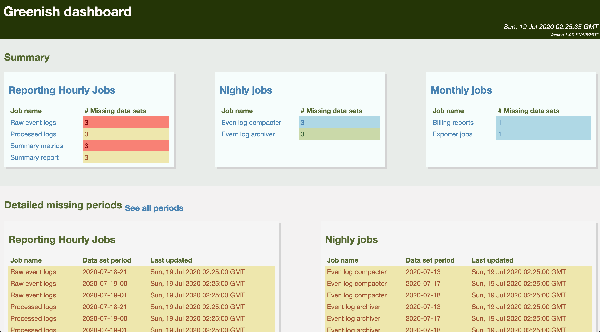

# Greenish

[](https://travis-ci.org/amanjpro/greenish)
[](https://codecov.io/gh/amanjpro/greenish)

Greenish is a monitoring tool, that can be used to monitor the presense of
data-sets. Greenish understands periods, for example for an hourly job,
Greenish can check for data for all the past _N_ hour data-sets.

Greenish jobs are configured in a
[YAML-like](https://github.com/lightbend/config) configuration file, [here is
an annotated example](src/test/resources/application.conf). Greenish does not
have a standard monitoring scripting language/plugin. Monitoring tasks can be
in any executable form, details are in [Monitoring Jobs](#monitoring-jobs).

## Monitoring Jobs

As mentioned earlier, monitoring jobs can be any executable program, as long as:

- They are exectable
- They accept a variable number of `period` arguments, as their last argument
  sets: `$ monitor_my_job.sh staging 2020-20-06-10 2020-20-06-10 ...` The above
  is an example of a monitoring script that is written in a `shell-like`
  scripting language.  Takes a parameter for the environment (in this case,
  `staging` is applied), and takes a set of `period` parameters, in the
  example: `2020-02-06-10` and `2020-02-06-11` are passed.

  The `check-command` entry for the above example will be:
  ```
    check-command: "monitor_my_job staging"
    period-pattern: "yyyy-MM-dd-HH"
  ```

- They print the health for every provided period, exactly once, in the
  following format: `greenish-period\t$PERIOD\t1` when the the period's health
  is OK, or `greenish-period\t$PERIOD\t0` otherwise. It is important that:
    - $PERIOD is in the list of the provided periods.
    - The text above is in a separate line, namely the line should match:
      `^greenish-period\t.*(0|1)$`.
    - The three parts of the line are tab separated.
- The scripts can have any number debugging printed lines.
- The script should exit with 0, under normal circumistances even if the entire
  set of periods are not in a good health.

An example monitoring script can be like this:

```
#!/usr/bin/env bash

farm=$1

shift

echo "LETS PRINT THINGS"

for period in "$@"; do
  echo "DEBUG HERE TOO"
  if ls "$farm/$period"; then
    echo -e "greenish-period\t$period\t1"
  else
    echo -e "greenish-period\t$period\t0"
  fi
done
```

## Performance Tweaking

The monitoring jobs are usually blocking IO jobs. Do that network call, wait
for this API, connect to a DB, HDFS etc. That is why they are running under
their very own execution contect (thread pool). So that they do not block the
rest of the service (namely the endpoints). The execution context config for
the monitoring jobs are controlled by a dispatcher named `refresh-dispatcher`,
an example config provided in the example application config which is
introduced earlier.

It is best to use `thread-pool-executor` dispatcher for blocking jobs, as they
are tailored for IO jobs. More information can be found:

- [ThreadPoolExecutor Javadoc](https://docs.oracle.com/javase/8/docs/api/java/util/concurrent/ThreadPoolExecutor.html)
- [Akka documentaiton](https://doc.akka.io/docs/akka-http/current/handling-blocking-operations-in-akka-http-routes.html#solution-dedicated-dispatcher-for-blocking-operations)

## Greenish dashboard

Greenish provides a basic HTML dashboard to visualise the state of the
monitored jobs. The dashboard can be accessed at: `/dashboard` endpoint.
Here is a screenshot:



## The API

Greenish supports four REST endpoints:

### Display the maximum number of missing datasets 

Basically, for all the jobs, find the job that misses the most number of
period datasets, and return the value.

```
$ curl --silent -G http://0.0.0.0:8080/maxlag | jq .
{
  "lag": 0
}
```
### Summary

Display the summary of all the monitoring tasks. Very good for a quick glance:

```
$ curl --silent -G http://0.0.0.0:8080/summary | jq .
[
  {
    "group_id": 0,
    "name": "Group1",
    "status": [
      {
        "job_id": 0,
        "name": "Job1",
        "missing": 4,
        "alert_level": "warn"
      },
      {
        "job_id": 1,
        "name": "Job2",
        "missing": 2,
        "alert_level": "normal"
      }
    ]
  },
  {
    "group_id": 0,
    "name": "Group2",
    "status": [
      {
        "job_id": 0,
        "name": "Job3",
        "missing": 6,
        "alert_level": "critical"
      },
      {
        "job_id": 1,
        "name": "Job4",
        "missing": 0,
        "alert_level": "great"
      }
    ]
  }
]
```

### Display all the periods that are missing for all the jobs

```
$ curl --silent -G http://0.0.0.0:8080/missing | jq .
[
  {
    "group": {
      "group_id": 0,
      "name": "Group1",
      "jobs": [
        {
          "job_id": 0,
          "name": "Job1",
          "cmd": "/tmp/first_script",
          "time_pattern": "yyyy-MM-dd-HH",
          "frequency": "hourly",
          "timezone": {
            "zone_id": "UTC"
          },
          "lookback": 24,
          "alert_levels": {
            "great": 0,
            "normal": 1,
            "warn": 2,
            "critical": 3
          }
        }
      ]
    },
    "status": [
      {
        "job": {
          "job_id": 0,
          "name": "Job1",
          "cmd": "/tmp/first_script",
          "time_pattern": "yyyy-MM-dd-HH",
          "frequency": "hourly",
          "timezone": {
            "zone_id": "UTC"
          },
          "lookback": 24,
          "alert_levels": {
            "great": 0,
            "normal": 1,
            "warn": 2,
            "critical": 3
          }
        },
        "updated_at": 1593567901,
        "period_health": [
          {
            "period": "2020-06-27-20",
            "ok": false
          }

      ...
```

### Display the current state

A very detailed view for all monitoring tasks:

```
$ curl --silent -G http://0.0.0.0:8080/state | jq .
[
  {
    "group": {
      "group_id": 0,
      "name": "Group1",
      "jobs": [
        {
          "job_id": 0,
          "name": "Job1",
          "cmd": "/tmp/first_script",
          "time_pattern": "yyyy-MM-dd-HH",
          "frequency": "hourly",
          "timezone": {
            "zone_id": "UTC"
          },
          "lookback": 24,
          "alert_levels": {
            "great": 0,
            "normal": 1,
            "warn": 2,
            "critical": 3
          }
        }
      ]
    },
    "status": [
      {
        "job": {
          "job_id": 0,
          "name": "Job1",
          "cmd": "/tmp/first_script",
          "time_pattern": "yyyy-MM-dd-HH",
          "frequency": "hourly",
          "timezone": {
            "zone_id": "UTC"
          },
          "lookback": 24,
          "alert_levels": {
            "great": 0,
            "normal": 1,
            "warn": 2,
            "critical": 3
          }
        },
        "updated_at": 1593567901,
        "period_health": [
          {
            "period": "2020-06-27-20",
            "ok": true
          },
          {
            "period": "2020-06-27-21",
            "ok": true
          },

        ...
```

### Get job and group by id

You can query a single group by its id:

```
$ curl --silent -G localhost:8080/group/1 | jq .
{
  "group": {
    "group_id": 1,
    "name": "Group2",
    "jobs": [
      {
        "job_id": 0,
        "name": "Job3",
        "cmd": "/tmp/third_script",
        "time_pattern": "yyyy-MM-dd",
        "frequency": "monthly",
        "timezone": {
    ...
```

You can also focus on a single job, and query it:

```
$ curl --silent -G localhost:8080/group/1/job/0 | jq .
{
  "job": {
    "job_id": 0,
    "name": "Job3",
    "cmd": "/tmp/third_script",
    "time_pattern": "yyyy-MM-dd",
    "frequency": "monthly",
    "timezone": {
      "zone_id": "UTC"
    },
    "lookback": 3,
    "alert_levels": {
      "great": 0,
      "normal": 1,
      "warn": 2,
      "critical": 3
    }
  },
  "updated_at": 1593585049298,
  "period_health": [
    {
      "period": "2020-05-01",
      "ok": true
    },
    {
      "period": "2020-06-01",
      "ok": true
    },
    {
      "period": "2020-07-01",
      "ok": true
    }
  ]
}
```

### Refresh the state of job and group by id

You can point refresh the state of a single group by its id:

```
$ curl --silent -G localhost:8080/group/0/refresh | jq .
{
  "ok": "Group status refresh is scheduled"
}
```

You can also point refresh the state of a single job by its id:

```
$ curl --silent -G localhost:8080/group/0/job/0/refresh | jq .
{
  "ok": "Job status refresh is scheduled"
}
```

## Pre-built package

You can download pre-built packages (both fat(assembly) jar and docker) from
the [releases page](https://github.com/amanjpro/greenish/releases). The latest
docker image can be found at the [packages page](https://github.com/amanjpro/greenish/packages).

## Development

### Requirements

- Java 8
- SBT 1.3.x
- Bash

### Building from the source

SBT takes care of building/testing:

`$ sbt clean test package`

To run the service from the source:
`$ sbt -Dconfig.file=PATH_TO_CONFIG_FILE run`

#### Packaging

Greenish supports both "fat jar", that is a single and self-contained jar that
can be distributed on any *nix environment (as long as Java and bash are
installed):

```
$ sbt assembly
$ java -Dconfig.file=PATH_TO_CONFIG_FILE target/scala-2.13/greenish-assembly-*.jar
```

You can also build docker images:

```
$ sbt docker:publishLocal
# The docker image expects config to be mounted at: /app/config.yml
$ docker run --volume PATH_TO_CONFIG_FILE:/app/config.yml --rm -p 8080:8080 greenish:LATEST_VERSION
```

## Contributing

Contributions are most welcome. Please, fork it, use it, open issues and submit PRs!
